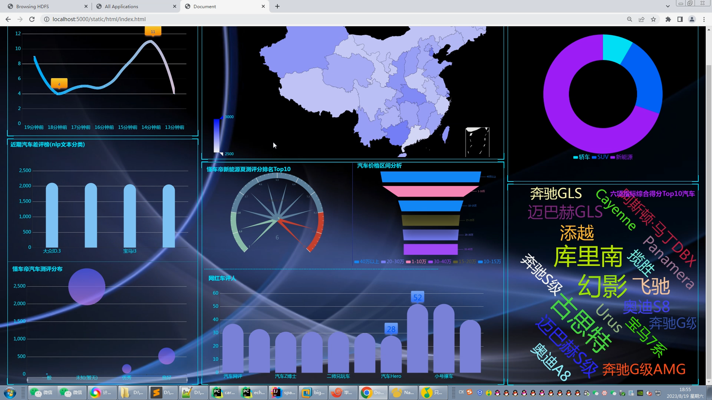
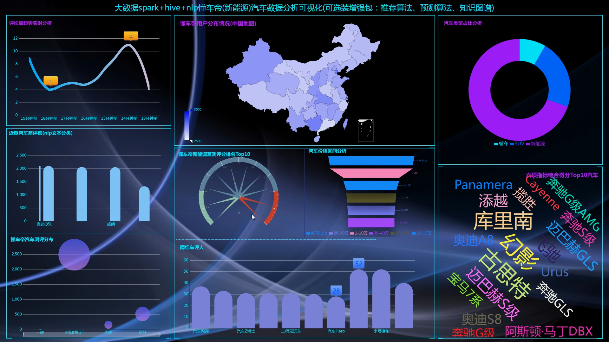
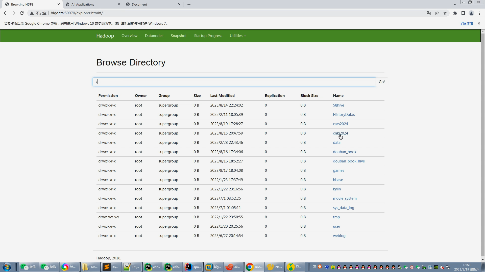
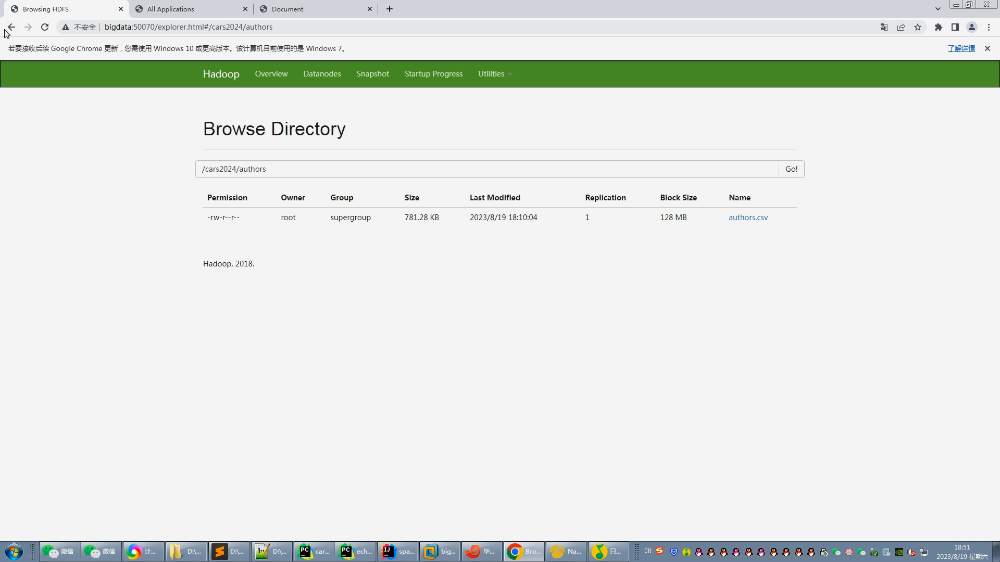
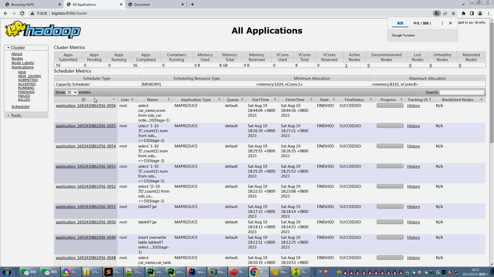
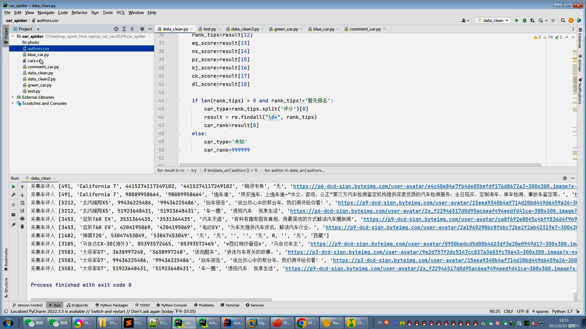
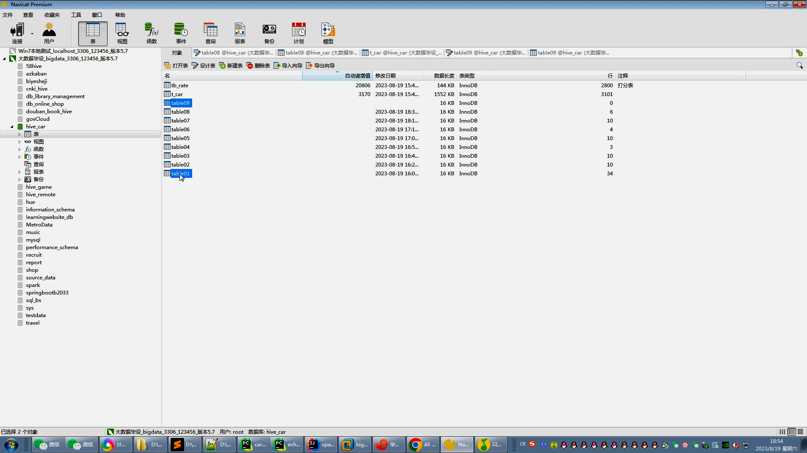
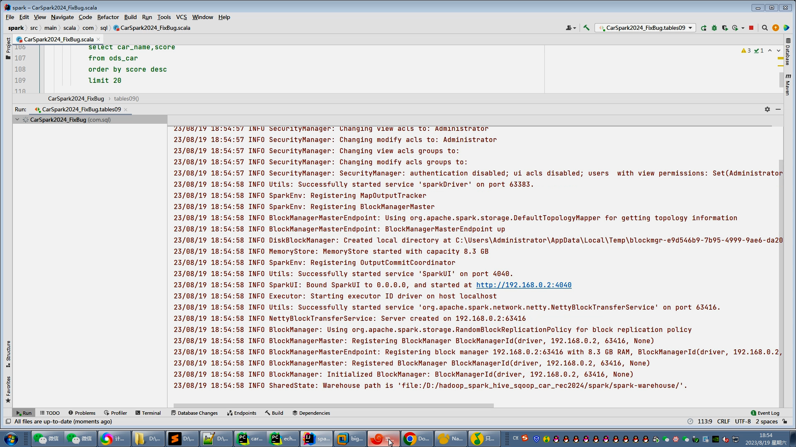
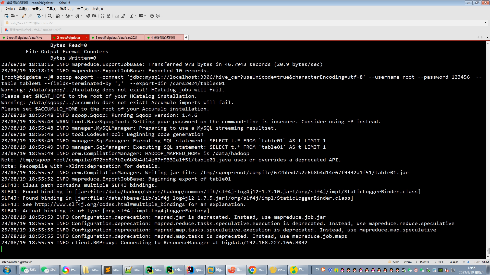

## 计算机毕业设计吊炸天hadoop+spark+hive汽车推荐系统 新能源汽车数据分析可视化大屏 新能源汽车推荐系统 汽车爬虫 汽车大数据 机器学习 大数据 大数据毕业设计 机器学习 知识图谱 大数据毕业设计 机器学习 预测系统 数据仓库 大数据毕业设计 文本分类 LSTM情感分析 大数据毕业设计 知识图谱 大数据毕业设计 预测系统 实时计算 离线计算 数据仓库 人工智能 神经网络

## 要求
### 源码有偿！一套(论文 PPT 源码+sql脚本+教程)

### 
### 加好友前帮忙start一下，并备注github有偿hive汽车推荐
### 我的QQ号是2827724252或者798059319或者 1679232425或者微信:bysj2023nb

# 

### 加qq好友说明（被部分 网友整得心力交瘁）：
    1.加好友务必按照格式备注
    2.避免浪费各自的时间！
    3.当“客服”不容易，repo 主是体面人，不爆粗，性格好，文明人。

基础版，也就是当前下面连接这个版本(只带hadoop spark hive flask sqoop  hdfs azkaban python爬虫 echarts大屏可视化驾驶舱)

https://www.bilibili.com/video/BV1d14y1y7HY/?spm_id_from=333.999.0.0

## 开发技术：
spark hadoop hive 装杯显摆虚拟机Linux敲命令炫酷吊打 flask echarts sqoop scala hdfs yarn mysql requests爬虫框架等；

## 流程： 

1.Python爬虫采集懂车帝汽车评分数据、汽车评论数据、车评人数据等存入mysql和.csv文件；

2.使用pandas+numpy或者MapReduce对上面的数据集进行数据清洗生成最终上传到hdfs；

3.使用hive数据仓库完成建库建表导入.csv数据集；

4.使用hive之hive_sql进行离线计算，使用spark之scala进行实时计算；

5.将计算指标使用sqoop工具导入mysql；

6.使用Flask+echarts进行可视化大屏实现；

## 创新点：
nlp文本分类情感分析、装杯大屏幕、Python爬虫采集海量(10万+数据)、hive离线计算+spark实时计算双实现防止导师喷你！

如果他(导师)还是狂喷不止，继续选择以下的系统，他们可以选装牛鼻功能！

## 可选装项目模块如下：
1.推荐系统(4种深度学习推荐算法 协同过滤基于用户 基于物品 SVD神经网络 MLP)。附带AI、支付、短信、lstm情感分析。
2.预测系统(KNN CNN RNN卷积神经预测 K-means 线性回归)。
3.知识图谱neo4j可视化关系网络图。
4.后台管理系统。

## 选装视频效果如下：
##  注意：如果你还觉得系统工作量不够或者太low可以选装推荐算法、预测算法、知识图谱、后台管理等，实现效果如下(本人保证可以0秒无缝选装无缝对接！)：

https://www.bilibili.com/video/BV1cb4y1n7Yy/?spm_id_from=333.999.0.0

